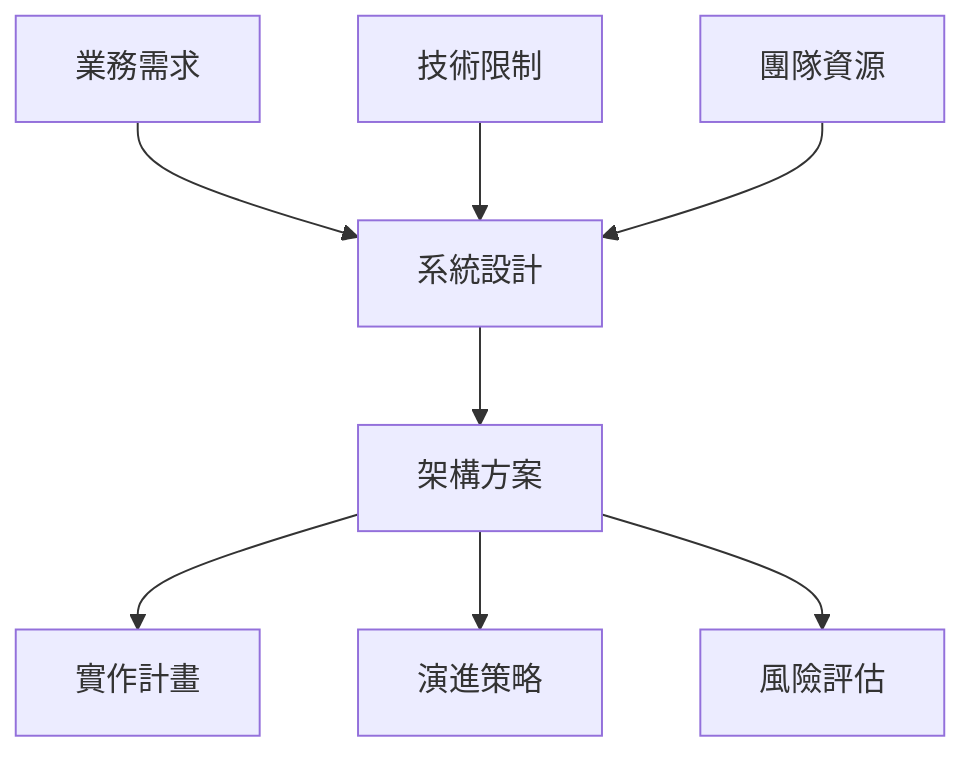
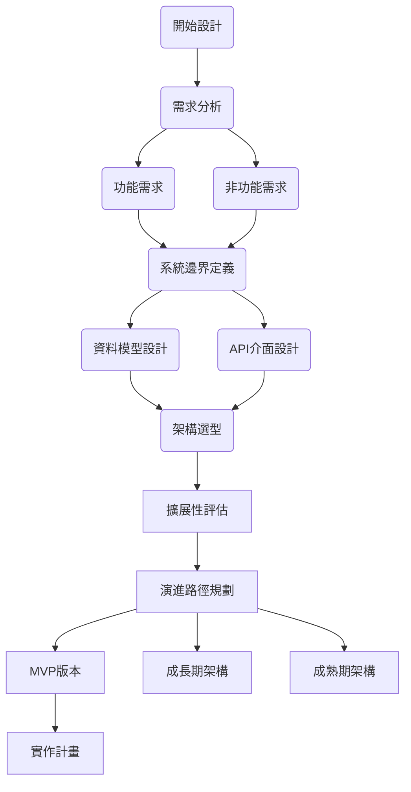

> 本系列參考 [30個系統設計實戰：全端工程師的架構修煉系列](https://ithelp.ithome.com.tw/articles/10378109)，希望可以做為練習來磨練自己對於各種系統設計的思考方式。

--------

今天是我們三十天系統設計實戰旅程的第一天。在開始設計第一個系統之前，讓我們先談談什麼是真正的系統設計，以及接下來的旅程會如何展開。

## 系統設計到底在設計什麼？
系統設計是一門藝術，需要在眾多限制條件下找到最適合的解決方案。

系統設計不是把功能實作出來就好。真正的挑戰在於理解需求的本質、預見系統的演進、平衡各種技術與商業考量。

首先，我們需要理解業務需求。一個電商系統最重要的是什麼？是每秒能處理多少訂單，還是確保每筆交易的正確性？是快速上線新功能，還是維持系統的穩定性？不同的答案會導向完全不同的架構設計。

其次，我們必須考慮現實限制。團隊有多少人？預算有多少？上線時程有多緊？技術債務有多重？這些看似與技術無關的因素，往往是決定架構成敗的關鍵。

最後，我們要為未來留下空間。今天設計的系統，三個月後需求可能翻倍，一年後可能需要重構，三年後可能需要重寫。好的架構設計不是預測未來，而是在不確定中保持彈性。

## 三十天的學習路徑規劃
這三十個系統的選擇並非隨意。它們涵蓋了現代軟體開發中最常見的挑戰場景，從最基礎的CRUD應用到複雜的分散式系統，從面向消費者的社交平台到企業級的基礎設施。

* 第一週 基礎應用
  - 部落格系統
  - 投票系統
  - 短網址服務
  - 聊天室系統
  - 待辦事項
  - 圖片分享
  - 簡易電商
* 第二週 社交內容
  - 社交動態強
  - 問答平台
  - 影片串流
  - 在線協作文件
  - 新聞聚合
  - 學習平台
  - 活動預約
* 第三週 規模效能
  - 搜索引擎
  - 即時通訊
  - 線上遊戲
  - 金融交易
  - 物聯網
  - 推薦系統
  - 分散快取
* 第四週 企業架構
  - 多租戶SaaS
  - 微服務架構
  - 全球CDN
  - 監控系統
  - 容器編排
  - 資料倉儲
  - 認證授權

第一週的七個系統看似簡單，但每一個都包含了系統設計的核心概念。個人部落格系統讓我們思考內容管理與發布流程，投票系統帶出了併發控制與資料一致性問題，短網址服務則是經典的系統設計面試題，涉及編碼演算法、資料庫設計、快取策略等多個層面。

第二週我們會進入更複雜的領域。社交媒體的動態牆不只是簡單的資料展示，背後涉及複雜的排序演算法與個人化推薦。影片串流平台則需要考慮大檔案處理、CDN分發、自適應串流等技術挑戰。線上協作文件更是分散式系統的經典案例，需要解決即時同步與衝突處理的難題。

第三週聚焦於規模與效能。當系統面對百萬、千萬甚至億級使用者時，每個設計決策都會被放大檢視。搜尋引擎需要在海量資料中提供毫秒級的查詢回應，金融交易系統不能容忍任何資料遺失，IoT平台要處理來自數百萬設備的即時資料流。

第四週則是企業級系統的綜合考驗。多租戶SaaS平台需要在共享資源與租戶隔離間取得平衡，微服務架構要解決服務拆分與整合的難題，全球CDN系統涉及跨地域的資料同步與一致性保證。

## 建立架構思維框架
在接下來的三十天裡，我們會反覆運用一套思考框架。這不是僵化的公式，而是幫助我們系統性分析問題的工具。

第一步永遠是釐清需求。功能需求決定了系統要做什麼，非功能需求決定了系統要做到多好。一個每天一百個使用者的內部系統，與一個每秒十萬請求的公開服務，架構設計會完全不同。

第二步是定義系統邊界。哪些功能是核心，哪些可以依賴外部服務？要自己開發支付系統，還是整合第三方服務？要自建資料中心，還是使用雲端服務？這些決策會深刻影響後續的設計方向。

第三步是設計資料模型與API。資料如何組織、如何流動、如何被存取，這是系統的骨架。好的資料模型可以讓複雜的業務邏輯變得簡單，糟糕的設計則會成為永遠的技術債。

第四步是考慮系統的演進。從MVP到成熟產品，系統會經歷多個階段。理解這個演進路徑，才能做出適合當下的設計決策。

## 系統演進的典型路徑
讓我們透過一個簡單的例子，看看系統是如何從簡單演進到複雜的。以一個社交平台為例：

diagram4

diagram5

初期可能是單體應用配上關聯式資料庫，成長期可能需要加入快取和訊息佇列，成熟期可能演進為微服務架構。

每個階段都有其合理性，過早採用複雜架構反而會拖慢開發速度。

## 與 AI 協作的學習方式
這個系列文章採用的學習模式是：**與 AI 的深度協作**。

接下來的每篇文章都是與 AI 共同協作創作完成。這不是簡單的內容生成，而是一個深度的技術對話過程：

### 協作流程設計
* AI 協助：資訊整合、最新技術趨勢調研、多角度分析、內容結構化
* 人類學習者：從中學習，根據內容發問，進一步調整與優化文章
## AI 協作的學習優勢
透過與 AI 的協作，我們能夠從現有的知識進一步深入研究：

* **擴大知識覆蓋範圍**：快速獲取最新的技術資訊與業界案例
* **提升分析品質**：多維度評估技術方案的優劣取捨
* **保持內容時效性**：確保討論的技術選型符合當前趨勢
* **增強學習互動**：透過與 AI 對話，持續發問與總結，請 AI 判斷與回應，進一步深化理解
這種學習方式代表了 AI 時代學習的新趨勢：**不是被動接受知識，而是在對話中建構出理解**。

## 如何從這個系列獲得最大價值？
### 主動思考與設計
每天閱讀文章只是學習的開始。真正的成長來自於主動思考與實踐。

當你看到題目時，請先花十五分鐘自己設計一個解決方案。不要擔心對錯，重要的是培養系統性思考的習慣。

閱讀文章時，特別注意那些與你的設計不同的地方。為什麼會有這樣的差異？是考慮了哪些你沒想到的因素？或者你的方案其實在某些場景下更合適？

系統設計沒有標準答案，理解不同方案的優劣取捨才是關鍵。

### 實作與驗證
如果時間允許，選擇幾個感興趣的系統實際實作出來。

不需要完整的產品，一個能夠展示核心概念的原型就足夠。實作過程中遇到的問題，往往比讀十篇文章更有教育意義。

### 與 AI 深度對話
建議讀者在閱讀每篇文章時，也主動與 AI 進行技術討論：

對文章中的設計決策提出疑問
探討不同場景下的架構調整
請求更詳細的實作指導
討論最新的技術發展趨勢
讓我們一起探索這種全新的學習體驗。

## 準備啟程
明天我們將從「**個人部落格系統**」開始。這個看似簡單的系統包含了許多有趣的設計決策：靜態生成與動態渲染的權衡、內容管理的架構選擇、SEO 優化的技術考量，以及如何為未來的功能擴展預留空間。

記住，成為優秀的系統架構師不在於知道所有的技術細節，而在於能夠在複雜的限制條件下做出合理的取捨。接下來的三十天，我們會一起培養這種能力。

歡迎來到系統設計的世界。這裡沒有完美的答案，只有更適合的選擇。讓我們開始這段充滿挑戰與收穫的旅程。